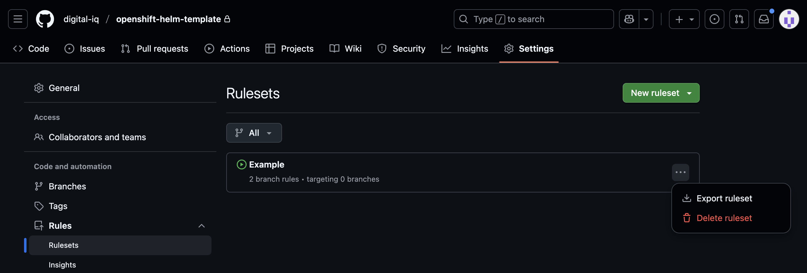
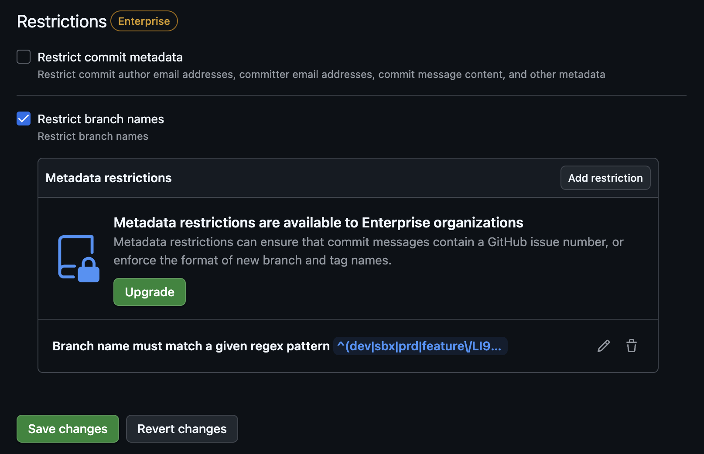

# GitHub Rulesets & Actions

This repository automatically applies rulesets and Actions settings to repositories 
based on a gh search query, on a schedule.

## Prerequisites

Make sure to [create a personal access token](https://github.com/settings/tokens) with the admin scopes named `POLICY_TOKEN`.

## How to create GitHub rulesets

Rulesets являются JSON:

```json
{
  "name": "Ruleset name",
  "target": "branch",
  "enforcement": "active",
  "conditions": {
    ...
  },
  "rules": [
    {
      ...
    }
  ]
}
```

JSON имеет два основных раздела, conditions и rules. Маппинга conditions к rules нет. Если мы хотим написать разные rules на разные ветки, указанные в 
conditions, придется создать два rulesets.

Rulesets легко сгенерировать используя:

1. Chat GPT, дополнительное обучение не требуется
2. GitHub UI
- Settings - Rules - Rulesets - New ruleset
- Export ruleset



Rulesets example:

```json
{
  "name": "Require PR for dev",
  "target": "branch",
  "enforcement": "active",
  "conditions": {
    "ref_name": {
      "include": [
        "refs/heads/dev"
      ],
      "exclude": []
    }
  },
  "rules": [
    {
      "type": "pull_request"
    }
  ]
}
```

**NOTES:** Некоторые ruleset требуют Enterprise подписку GitHub, например для стандартизации имен веток.



## How to apply GitHub rulesets

1. Add created before JSON rulesets under `policies/`.
2. Create *-ruleset.yml under `.github/workflows/` using template:
```yml
name: GitOps Branch

on:
  schedule:
    - cron: "0 0 * * *"
  workflow_dispatch: {}

jobs:
  apply:
    uses: ./.github/workflows/rulesets-apply.yml
    with:
      search_query: org:digital-iq in:name zazhogin-ansible archived:false fork:false
      policy_paths: |
        policies/allowed-branch-names.json
        policies/require-pr-for-dev.json
    secrets: inherit
```
3. Переопределите поля:
- `cron` расписание применения правил
- `search_query` правило поиска репозиториев для [gh search](https://cli.github.com/manual/gh_search)
- `policy_paths` массив ruleset

The workflow will:
- Find repositories matching the query (e.g. `org:digital-iq in:name ansible archived:false fork:false`).
- Delete all existing rulest.
- Apply the ruleset JSON if missing.

## Actions Settings

Rulesets do not cover **GitHub Actions settings**.  
To manage these, we call the REST API directly with `gh api`.

Examples:
- Allow all actions and reusable workflows:
  ```bash
  gh api -X PUT /repos/<owner>/<repo>/actions/permissions \
    --input - <<'JSON'
  {"enabled":true,"allowed_actions":"all"}
  JSON
